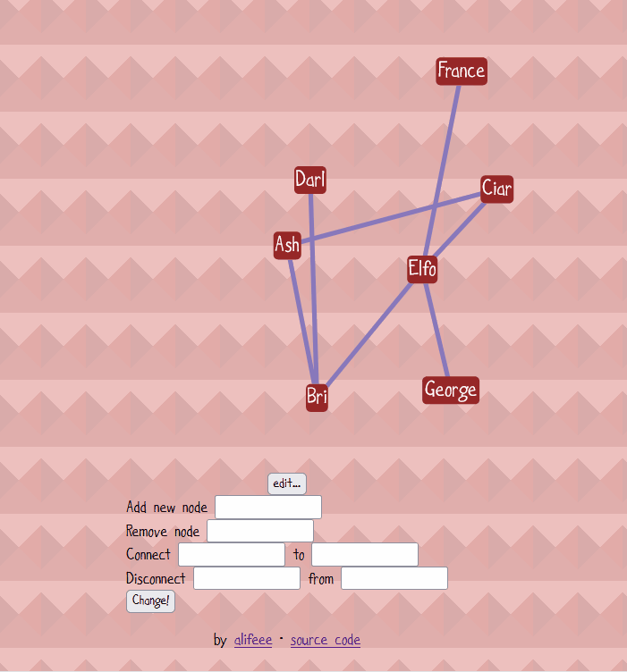

# Polycule Visualiser

A graph visualiser designed to be self-hosted.



## How to build site

### Install

```bash
npm install
cp polycule.json.example polycule.json
```

### Build site

```bash
npm run build
npm run dev
```
